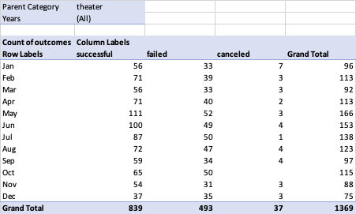
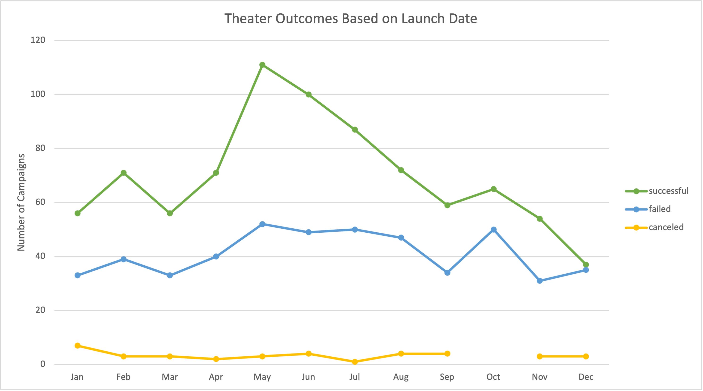
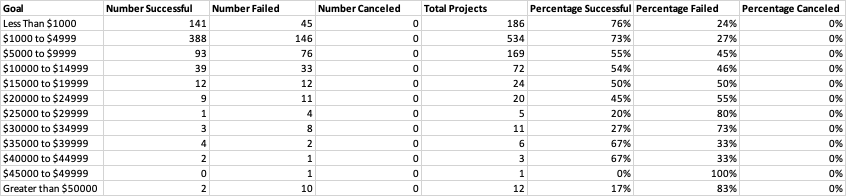
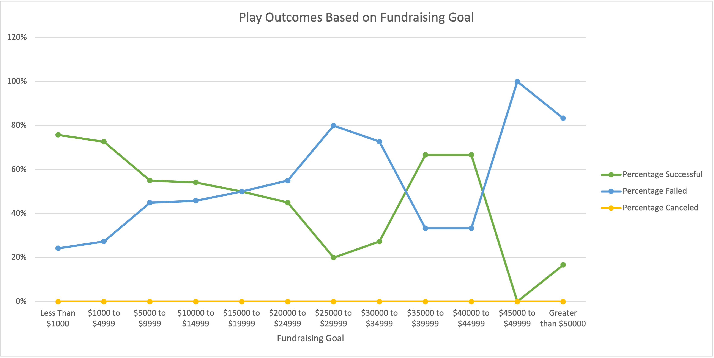

# Analysis of Kickstarter Campaign Performance

## Overview of Project

### Purpose
The purpose of this project is to analyze Kickstarter campaign data to inform the planning of a new campaign to raise funds for an up-and-coming playwright’s first play. This analysis seeks to identify factors that may contribute to a successful Kickstarter campaign, with a focus on campaigns raising funds for theater projects. The analysis will look specifically at campaign outcomes in relation to launch date and fundraising goals. I will also identify limitations of the available Kickstarter campaign data and opportunities for additional analysis that could provide further insight into designing a successful campaign. 

## Analysis and Challenges

All analysis for this project was performed using the [Kickstarter dataset](Kickstarter_Challenge.xlsx.zip).

### Analysis of Outcomes Based on Launch Date
The first analysis I performed looked at outcomes of Kickstarter campaigns for theater projects based on the month in which they were launched. 

To perform this analysis, I prepared the dataset as follows:
-	I separated the category/subcategory column used to categorize campaigns into a parent category column and subcategory column.
-	I converted the campaign launch dates from Unix timestamps to date formats using a formula. Example: (((J2/60)/60)/24)+DATE(1970,1,1)
-	I extracted the campaign launch years using the YEARS() function.

To create a graph with launch month on the x-axis and the count of theater campaigns for each outcome category on the y-axis, I first created a pivot table with the following setup:
-	I populated launch month (date created conversion) in rows, outcomes in columns, and count of outcomes in values. 
-	I included parent category and years as filters. 
-	I filtered the column labels on the pivot table to show only the outcome categories “successful” (met or exceeded fundraising goal), “failed” (did not meet fundraising goal), and “canceled,” and exclude the category “live” (currently in progress). 
-	Since the analysis is focused on theater projects, I used the parent category filter on the pivot table to include only data from campaigns in the theater category. 
-	The pivot table for all years combined is shown below.

From the pivot table, I created a line with markers pivot chart to visualize the number of theater campaigns in each outcome category by launch month. Using the years filter on the pivot table, I was able to examine campaign outcomes by month for all years combined as well as by individual year. The graph below titled Theater Outcomes Based on Launch Date shows outcomes for all years combined.

### Analysis of Outcomes Based on Goals
The second analysis I performed looked at outcomes of Kickstarter campaigns for plays based on their fundraising goal. 

To perform this analysis, I first created a new table to group campaigns for plays based on outcomes and goal ranges and to perform additional calculations. I populated the table as follows:
-	I used the COUNTIFS() function to populate the number of successful, failed, and canceled campaigns for plays for each goal range. Example: COUNTIFS(Kickstarter!$D:$D,">=1000",Kickstarter!$D:$D,"<=4999",Kickstarter!$F:$F,"successful",Kickstarter!$R:$R,"plays")
-	I used the SUM() function to sum the number of successful, failed, and canceled campaigns to get the total number for each goal range.
-	I used a formula to calculate the percentage of successful, failed, and canceled campaigns for each goal range.
-	The final table is shown below.

From this table, I created a line with markers chart with fundraising goal range on the x-axis and percentage of successful, failed, or canceled play campaigns on the y-axis. The graph below titled Play Outcomes Based on Fundraising Goal provides a visualization of how the percentage of campaigns that were successful, failed, or canceled changed as the fundraising goal increased.

### Challenges and Difficulties Encountered
Both challenges I encountered were in performing the analysis of outcomes based on goals.

The first challenge was setting up the COUNTIFS() function correctly to count the number of successful, failed, or canceled campaigns for plays when the goal range was between two dollar amounts (for example, $1000 to $4999) instead of greater or less than a single amount. I initially set up the function as COUNTIFS(Kickstarter!D:D,">=1000","<=4999",Kickstarter!F:F,"successful",Kickstarter!R:R,"plays"), which gave me an alert that I had entered too few arguments for the function. I knew that the rest of my function was set up correctly because it had worked in the previous cell where the goal range was less than $1000, so I figured out that I needed to select the goal column (column D) from the Kickstarter worksheet as the criteria_range a second time in order to set the upper bound of the campaign goal range.

The second challenge I encountered was that I did not initially use $ to indicate absolute cell references when setting up my COUNTIFS function. As a result, when I copied the formulas from the Number Successful column and pasted them into the Number Failed column with the plan to update the outcome criteria from “successful” to “failed,” the formulas were no longer referencing the correct criteria ranges. I started updating the criteria ranges in the Number Failed column manually, which was inefficient. I then realized I could use $ to indicate absolute cell references and thereby make the copying, pasting, and updating process more efficient as I went from the Number Successful to Number Failed and Number Canceled columns. 

## Results

### What are two conclusions you can draw about the outcomes based on launch date?
From the analysis of theater campaign outcomes based on launch date for all years combined, I found that the greatest number of successful campaigns were launched in the month of May (111), with June having the second highest number of successful campaigns (100). All other months had fewer than 100 successful campaigns launched. May, June, July, August, and October all had a similar number of failed campaigns (around 50), which was higher than for other months. Since May launched the most successful campaigns and had a similar number of failed campaigns as several other months that launched fewer successful ones, I can conclude that May is the most successful month in which to launch Kickstarter campaigns. June follows close behind as the second most successful month, with the same rationale.

The month of December had the smallest total number of campaigns (75) and the smallest number of successful campaigns (37). Additionally, the number of failed campaigns launched in December was almost equal to the number of successful campaigns for that month, whereas all other months had a greater number of successful campaigns than failed ones. Based on these data, I can conclude that December is the least popular and least successful month in which to launch Kickstarter campaigns. 

Note that the number of canceled campaigns was low compared with the numbers of successful and failed ones, and did not vary substantially across months, so canceled campaigns were not a major factor in conclusions drawn from these data.

### What can you conclude about the outcomes based on goals?
From the analysis of play campaign outcomes based on fundraising goals, I found that campaigns within the lowest goal range had the highest percentage that were successful: 76% of campaigns with a goal less than $1,000 were successful. The goal range $1,000 to $4,999 had the largest total number of campaigns and the second highest percentage that were successful (73%). As the goal ranges increased through the $25,000 to $29,999 range, both the total number of campaigns and the percentage of successful campaigns for each range decreased. Although there were only a small number of campaigns in the $35,000 to $39,999 and $40,000 to $44,999 ranges (6 and 3, respectively), these ranges had the third highest percentage of successful campaigns at 67%. Campaigns at the highest goal ranges ($45,000 to $49,999 and greater than $50,000) had the lowest percentages successful. Based on these data, I can conclude that play campaigns at the low end of the fundraising goal ranges are most likely to be successful, with goals in the range of $1,000 to $4,999 being most common and second most successful. 

### What are some limitations of this dataset?
One limitation of the dataset is that it is not entirely clear whether the data in the goal and pledged columns (columns D and E) are reported in USD or in the currency type listed in the currency column (column H). Based on the format of the numbers in the goal and pledged columns, the amounts appear to be reported in USD, but campaigns from countries other than the US have other currency types listed in the currency column. Having goal and pledged columns listing amounts in the original currency and then separate goal and pledged columns with amounts converted to USD would allow us to be confident that we are analyzing campaign performance with goal and pledged amounts in a common currency.

Another limitation of the dataset is that it only includes data for campaigns launched through the first quarter of 2017. It would be beneficial to have more recent campaign data in order to provide more current insight into factors that may contribute to a successful campaign. This is especially true as Kickstarter campaign characteristics and outcomes may have been impacted by the COVID pandemic.

Lastly, it is a limitation that the dataset only provides country-level information about the location of campaigns, even though the Kickstarter site has state- and city-level location information. Having state- and city-level location information would allow for further regional analysis of campaign outcomes.

### What are some other possible tables and/or graphs that we could create?
In analyzing outcomes based on launch date, it would be useful to look at the percentages of successful, failed, and canceled campaigns and not only the count of campaigns for each outcome category. As noted above, the Theater Outcomes Based on Launch Date graph showed the highest number of successful campaigns for May followed by June, but these months also had the highest total number of campaigns. Visualizing the outcomes as percentages of total campaigns for the month would aid in interpreting the data.

It may also be of interest to look at outcomes for theater and/or play campaigns based on campaign duration. This would require calculating campaign duration using the launch and end dates and creating a table with number and percentage of successful, failed, and canceled campaigns by duration category (for example, less than or equal to 2 weeks, greater than 2 weeks to 4 weeks, greater than 4 weeks to 6 weeks, etc.). From this table, a line graph could be created similar to the one for analyzing outcomes based on goals.

The dataset includes a column indicating whether a campaign was a staff pick (column K). A 100% stacked column chart with staff pick false and true on the x-axis and percentage of successful, failed, or canceled campaigns on the y-axis could be of interest to see whether campaigns selected as a staff pick are more likely to be successful.
